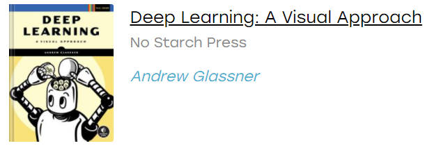
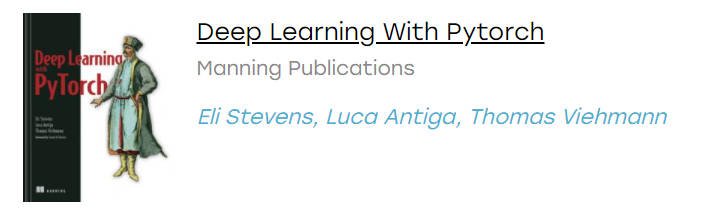

## 关于 AI 的资源导航

### 1.书籍搜索网站推荐(去中心化)

[zlibrary 快捷入口](https://zlib.yibook.org/)：显示公共账户的额度

[zhelper search](https://tool.yibook.org/)：强大的书籍搜索网站

### 2.资源推荐

- [Deep Learning - A Visual Approach](https://github.com/blueberrymusic/Deep-Learning-A-Visual-Approach)

- [Deep Learning with by pytorch](https://github.com/deep-learning-with-pytorch/dlwpt-code)

  [中文网页版](https://tangshusen.me/Deep-Learning-with-PyTorch-Chinese/#/)

  [翻译项目地址](https://github.com/ShusenTang/Deep-Learning-with-PyTorch-Chinese)

