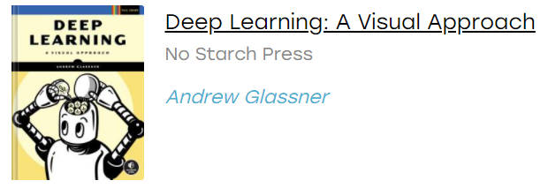
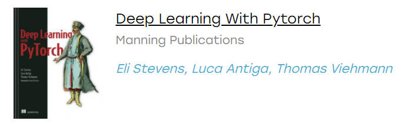

# 关于 AI 的资源导航

## 1.书籍搜索网站推荐(去中心化)

[zlibrary 快捷入口](https://zlib.yibook.org/)：显示公共账户的额度

[zhelper search](https://tool.yibook.org/)：强大的书籍搜索网站


## 2.推荐路线

> 参照 ：[啥都会一点研究生视频](https://www.bilibili.com/video/BV16341177c1/?spm_id_from=333.1007.top_right_bar_window_history.content.click&vd_source=412ee9f1892496b8506f8302ac9d1437) && [AI-Expert-Roadmap](https://github.com/AMAI-GmbH/AI-Expert-Roadmap)

### 基础学习

数学基础：高数，线性代数。可参照考研数学和 [MIT 18.06 Linear Algebra](https://www.bilibili.com/video/BV16Z4y1U7oU/?spm_id_from=333.337.search-card.all.click&vd_source=412ee9f1892496b8506f8302ac9d1437) 课程。

一门编程语言：推荐 Python

深度学习是机器学习的一个重要的分支

专业基础：李航的 《统计学习方法》

机器学习：台湾大学李宏毅课程，吴恩达课程，浙江大学胡浩基课程

深度学习：吴恩达 DeepLearning AI课程 + Github配套笔记

框架学习：Tensorflow 2.0 龙良曲，Pytorch 龙良曲，同时也对前面的知识进行回顾复习。

### 两大框架

**首推 Pytorch**

[Personal Pytorch Notes](https://github.com/Wanggs2418/PyTorch_notes)

**Tensorflow**

[Personal TF_Notes](https://github.com/Wanggs2418/TensorFlow_notes)

### 方向选择

**CV (Computer Vision) 方向：**

《OpenCV3编程入门》 + [官网教程](https://docs.opencv.org/4.x/d9/df8/tutorial_root.html)

北京交通大学 MOOC 慕课图像处理和机器学习

唐宇迪的OpenCV 计算机视觉项目实战

[斯坦福大学的 CS231n 课程](http://cs231n.stanford.edu/schedule.html)—面向视觉识别的卷积神经网络

传统目标检测模型实践：YOLO，SSD，R-CNN 等，初始可在公开数据集上训练

数据集标注学习：[mmdetcction](https://github.com/open-mmlab/mmdetection)

**NLP (Natural Language Processing) 方向：**

**RL (Reinforcement Learning) 方向：**


## 3.本地部署Ollama

### 快速部署

[Ollama](https://ollama.com/) | [Ollama Github](https://github.com/ollama/ollama)

```cmd
# 显示ollama常用命令
ollama

# 下载大模型qwen7b到本地（注意大模型占用的内存大小）
# b表示10参数(w,b)，7b即共70亿参数的大模型
ollama pull qwen2:7b

# 查看已经安装的大模型
ollama list

# 删除
ollama rm qwen2:7b

# 显示模型的基本信息
ollama show qweb2:7b

# 本地运行大模型(注意电脑配置)
ollama run qwen2:7b
```

### Ollama 接口开发

默认端口号：11434

```cmd
# 浏览器访问
http://localhost:11434/

# 使用 python 调用接口访问本地大模型
pip show requests
pip install requests
```

**API 调用**

```cmd
import requests
url = "http://localhost:11434/api/generate"
payload = {
    "model": "qwen2",
    "prompt": "介绍qwen2模型",
    "stream": False
}

response = requests.post(url, json=payload)
print("response:", response.json()['response'])
```


## 4.资源推荐

### 资源网址

- [AINAV.net 网站](https://www.ainav.net/)
- [逐行讲解论文代码](https://github.com/labmlai/annotated_deep_learning_paper_implementations) (使用 PyTorch)

### 项目

一些项目本地部署流程见：[项目部署流程指导](Project_Deployment\项目部署.md)

- [GFPGAN](https://github.com/TencentARC/GFPGAN)：照片修复

### 相关书籍

- [Deep Learning - A Visual Approach](https://github.com/blueberrymusic/Deep-Learning-A-Visual-Approach)



- [Deep Learning with by pytorch](https://github.com/deep-learning-with-pytorch/dlwpt-code)

  [中文网页版](https://tangshusen.me/Deep-Learning-with-PyTorch-Chinese/#/)

  [翻译项目地址](https://github.com/ShusenTang/Deep-Learning-with-PyTorch-Chinese)



